# **Nutrifacts** 

#### Welcome to Nutrifacts, where scanning a barcode is the easiest step to a healthier you

This repository is the Capstone Project in [Bangkit Academy](https://grow.google/intl/id_id/bangkit/) 2023. 
Nutrifacts is a food product health app designed to solve the perplexing task of making informed nutritional decisions. We seek to empower people with the ability to effortlessly decode the nutritional content and health level of any product through a simple barcode scan anywhere, anytime..  
  

## Our Team
| Name                            | Bangkit-ID    | Path               |
| -------------                   | ------------- | -------------      |
| Dzaky Adla Hikmatiyar           | A004BSY2088   | Mobile Development |
| Rangga Saputra                  | C171BSY3346   | Cloud Computing    |
| Ahmad Ryan Al Aqsha             | C208BSY4225   | Cloud Computing    |
| Mohamad Vikry Athari            | M004BSY1465   | Machine Learning   |
| Riefky Ichsan Baihaqi           | M010BSY1309   | Machine Learning   |
| Guntur Awaludin Saptadi         | M200BSY1914   | Machine Learning   |

# Application Install

***You can Install and test latest Next Hotel app from below 👇***

## Getting started
- Prerequisites
  - Android
  - Internet connection

- Installation
  - Download the APK
  - Install the APK

## Usage
- How to discover news related to food and beverage products around the world
  - Open App.
  - On home screen, choose and read your news.

- How to find product nutrition data by name
  - Open App.
  - On search screen, type the product name on the search bar.

- How to scan barcode
  - Open App.
  - On home screen, click on the floating action button wtih QR code icon.
  - Scan the barcode using landscape orientation.

- How to get history
  - Open App.
  - On home screen, click on the list icon.
  - Scroll through your histories.

## Setup
Clone the repository on your machine. Open the project on your IDE and run it.

## About
- Food and beverage products news from around the world
- Scan the barcode and be healthier
- Explore through products
- Clean and Simple Material UI
- Light Mode and Dark Mode 🌗

## 📸 Screenshots
||||
|:----------------------------------------:|:-----------------------------------------:|:-----------------------------------------: |
| 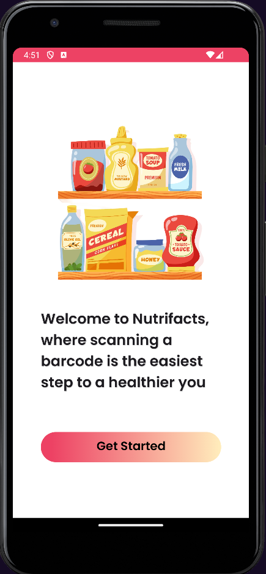 | 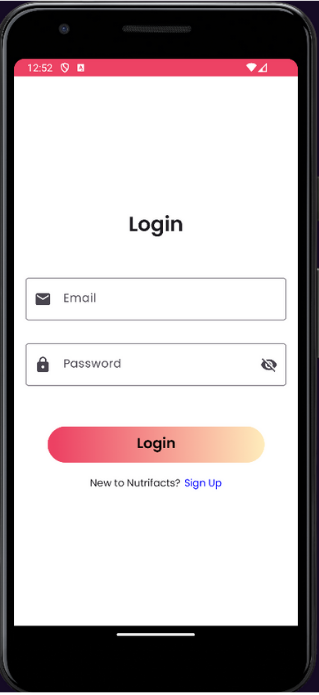 | 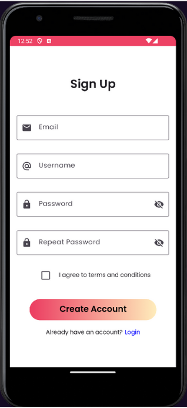 
| 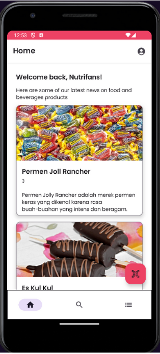 | 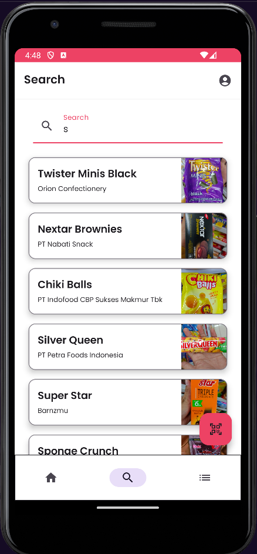 | 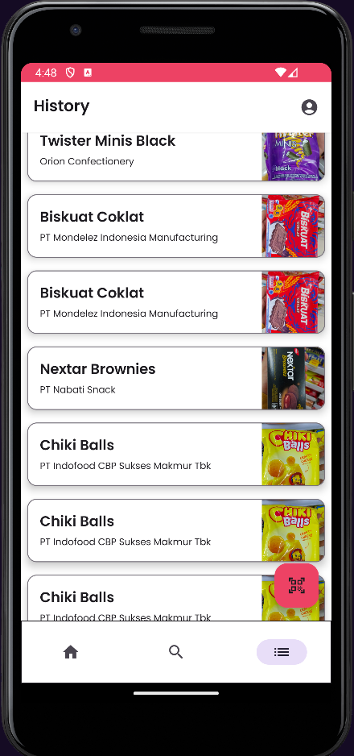
| 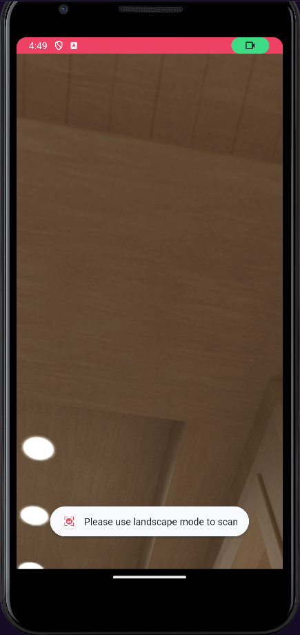 | 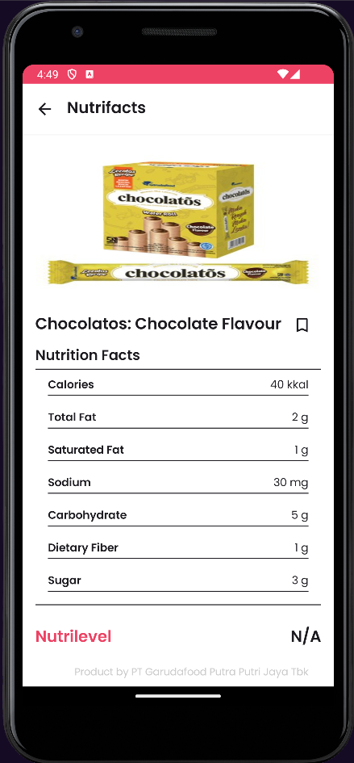 | 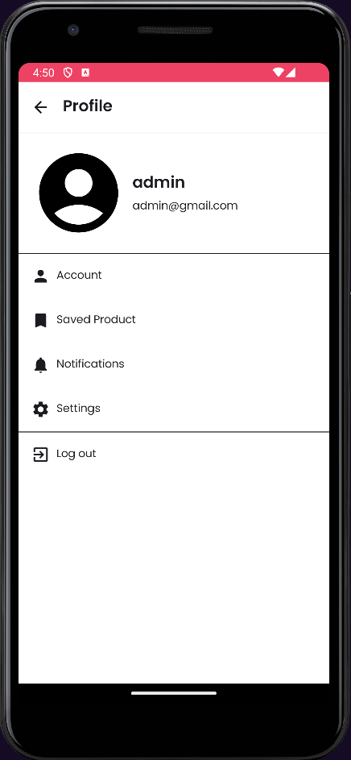 
| 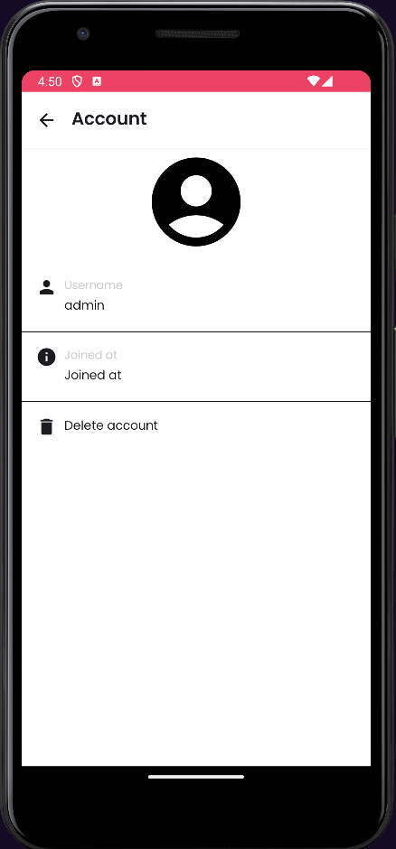 | 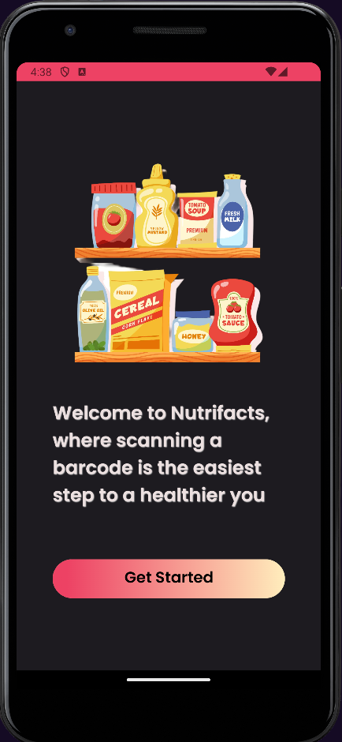 | 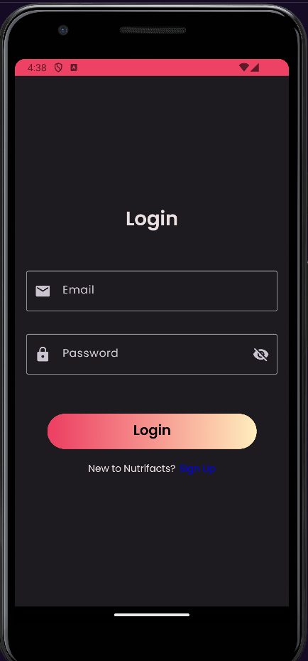 
| 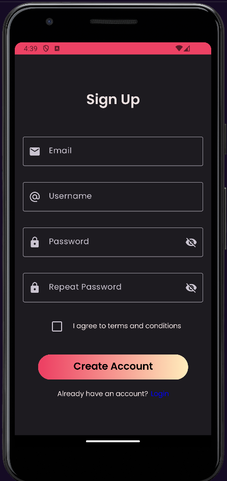 | 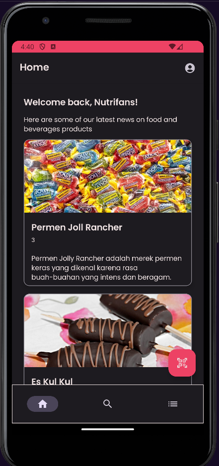 | 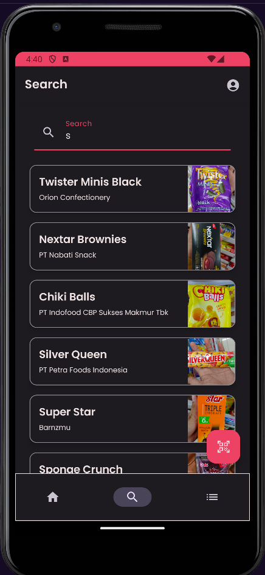
| 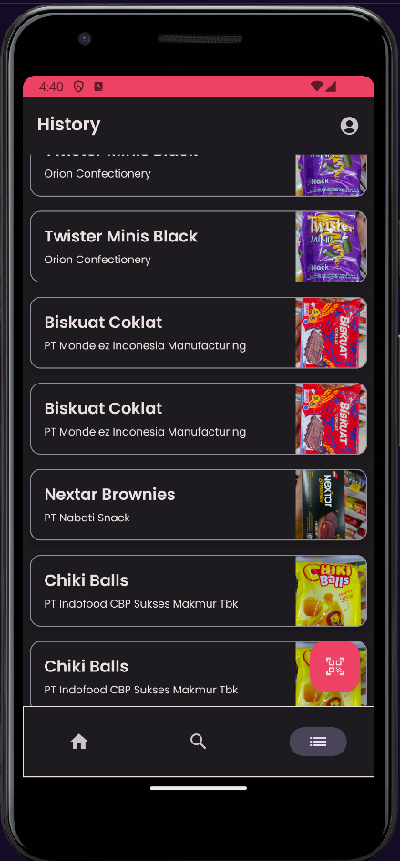 | 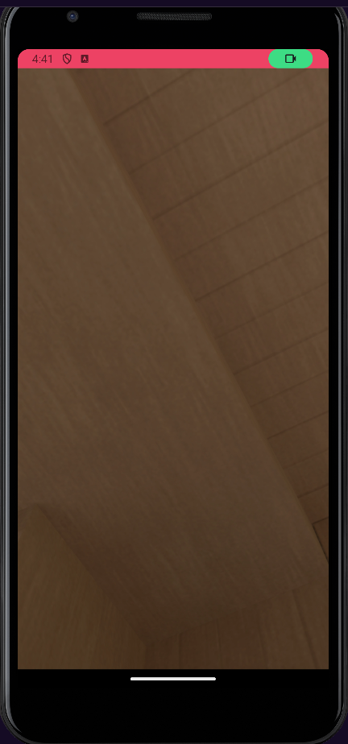 | 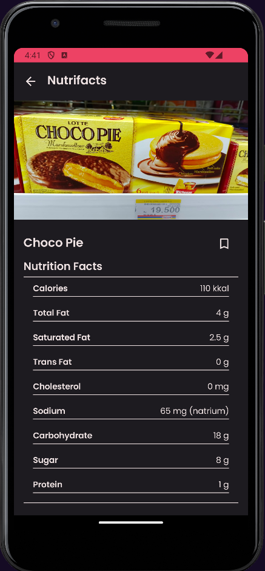 
| 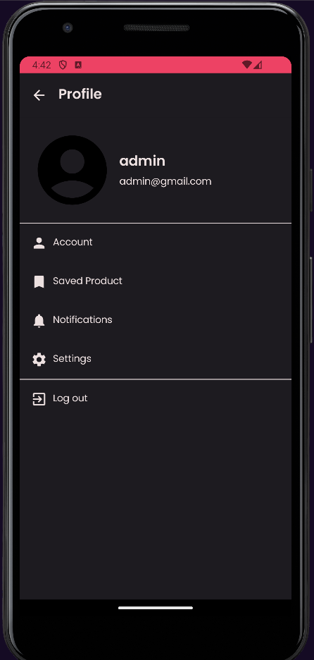 | 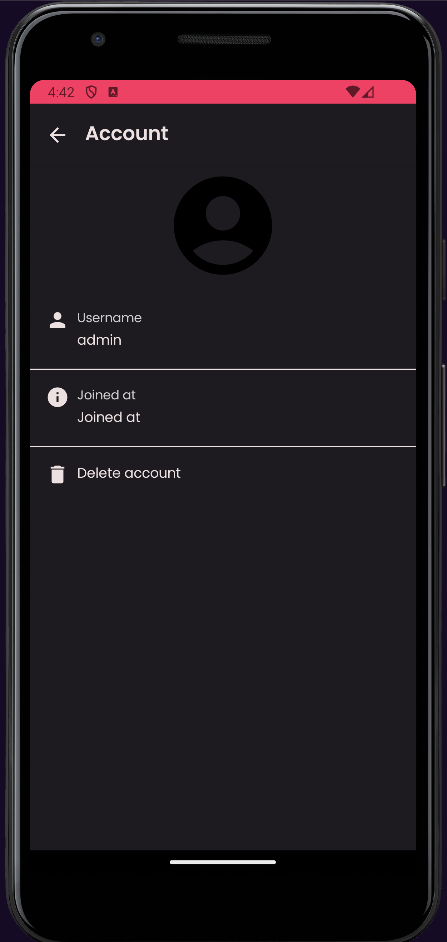

## Built With 🛠
- [Kotlin](https://kotlinlang.org/) - First class and official programming language for Android development.
- [Jetpack Compose](https://developer.android.com/jetpack/compose) - Jetpack Compose is Android's recommended modern toolkit for building native UI. It simplifies and accelerates UI development on Android.
- [Coroutines](https://kotlinlang.org/docs/reference/coroutines-overview.html) - A coroutine is a concurrency design pattern that you can use on Android to simplify code that executes asynchronously.
- [Android Architecture Components](https://developer.android.com/topic/libraries/architecture) - Collection of libraries that help you design robust, testable, and maintainable apps.
    - [ViewModel](https://developer.android.com/topic/libraries/architecture/viewmodel) - Stores UI-related data that isn't destroyed on UI changes.
    - [Data Store](https://developer.android.com/topic/libraries/architecture/datastore) - Data storage solution that allows you to store key-value pairs or typed objects with protocol buffers.
- [Dependency Injection](https://developer.android.com/training/dependency-injection) - A technique widely used in programming and well suited to Android development.
- [Room](https://developer.android.com/jetpack/androidx/releases/room) - Room is a database layer on top of an SQLite database.
- [Retrofit](https://square.github.io/retrofit/) - A type-safe HTTP client for Android and Java.
- [GSON](https://github.com/google/gson) - A modern JSON library for Kotlin and Java.
- [GSON Converter](https://github.com/square/retrofit/tree/master/retrofit-converters/gson) - A Converter which uses GSON for serialization to and from JSON.
- [Material Components for Android](https://github.com/material-components/material-components-android) - Modular and customizable Material Design UI components for Android.

## Contact
Visit:
- [dzakyadlh git](https://github.com/dzakyadlh)
